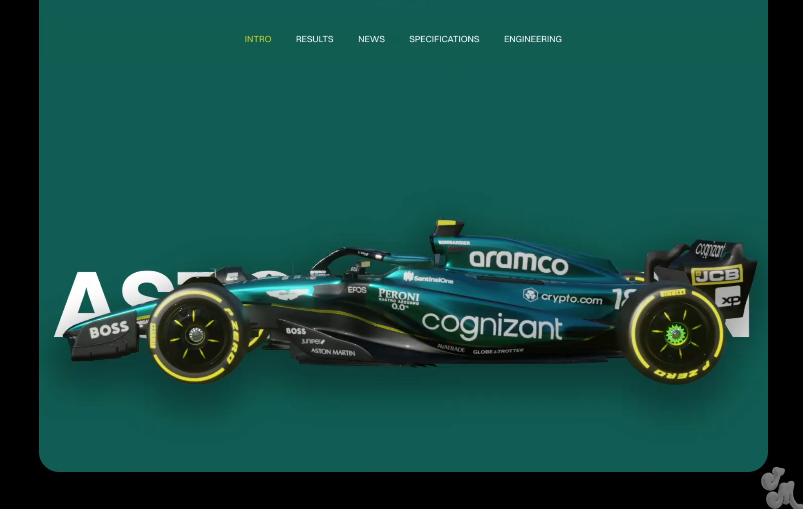

# F1 — Sécurité & Performance : Une Histoire en Parallèle

> Projet de visualisation de données — Cours VisualDon, HEIG-VD

---

## Description

Ce projet est un **scrollytelling interactif** qui explore l'évolution conjointe de la **sécurité** et de la **performance** en Formule 1, depuis les débuts du championnat du monde en 1950 jusqu'à nos jours.

À travers une narration guidée par le scroll, le visiteur traverse les grandes époques de la F1 : une époque pionnière marquée par des accidents mortels à répétition, puis une prise de conscience progressive ayant mené aux réformes réglementaires, jusqu'aux monoplaces ultra-sécurisées et ultra-rapides d'aujourd'hui.

Le projet soulève une tension centrale : **peut-on aller plus vite tout en étant plus en sécurité ?** Les données suggèrent que oui et c'est cette histoire que nous voulons raconter.

### Structure des données

La source principale est le dataset Kaggle **Formula 1 World Championship (1950–2020)**, constitué de plusieurs fichiers **CSV** liés entre eux par des identifiants communs (`raceId`, `driverId`, `circuitId`…). Les fichiers clés pour notre projet sont :

| Fichier | Attributs principaux | Types |
|---------|----------------------|-------|
| `races.csv` | `year`, `round`, `circuitId`, `name`, `date` | Numérique, Catégoriel, Temporel |
| `results.csv` | `position`, `points`, `laps`, `milliseconds`, `fastestLapSpeed`, `statusId` | Numérique, Catégoriel |
| `lap_times.csv` | `lap`, `position`, `time`, `milliseconds` | Numérique, Temporel |
| `qualifying.csv` | `position`, `q1`, `q2`, `q3` (temps) | Numérique, Temporel |
| `circuits.csv` | `name`, `location`, `country`, `lat`, `lng`, `alt` | Catégoriel, Géographique |
| `drivers.csv` | `forename`, `surname`, `dob`, `nationality` | Catégoriel, Temporel |

Les temps sont exprimés en **millisecondes** (entiers) ou en format `MM:SS.mmm` (chaîne de caractères). Les positions et points sont des **entiers**. Les données géographiques des circuits sont en **coordonnées décimales**. Les données d'accidents et de décès, absentes de ce dataset, proviennent de sources externes et sont structurées manuellement.

---

## Contexte

Les données utilisées proviennent principalement de sources communautaires et indépendantes construites autour des informations officielles de la Formule 1.

Notre **source principale** est le dataset **[Formula 1 World Championship (1950–2020)](https://www.kaggle.com/datasets/rohanrao/formula-1-world-championship-1950-2020)** publié sur Kaggle par Vopani (Rohan Rao). Ce dataset consolide l'ensemble des données historiques du championnat — résultats, qualifications, temps au tour, classements, circuits, pilotes et écuries — en fichiers CSV structurés couvrant 70 ans de compétition. Ce n'est pas la FIA ni Formula One Management (FOM) — l'organisation commerciale — qui ont rendu ces données publiques et structurées, mais des acteurs extérieurs motivés par la passion du sport et la culture open data. Des sources complémentaires comme **OpenF1** ou **FastF1** peuvent être mobilisées pour des données télémétriques plus granulaires.

Les données sur les **accidents et les décès** sont compilées depuis des sources journalistiques, des archives historiques et des rapports FIA. Elles ne sont pas centralisées systématiquement : leur existence dépend de ce qui a été médiatisé ou documenté officiellement.

**Biais et absences identifiables :**

- **Incomplétude historique** : les données antérieures aux années 1980 sont moins fiables. Les résultats et détails techniques des premières décennies ont été reconstitués a posteriori depuis des archives parfois fragmentaires.
- **Biais de circuit** : les temps au tour varient considérablement selon les tracés. Pour neutraliser ce biais, nous comparons les performances sur un même circuit à travers les époques, ce qui garantit des conditions géométriques comparables.
- **Absence de données d'accidents** : les APIs et datasets choisis ne recensent pas les incidents de course. Les données sur les accidents et décès sont issues de sources externes (archives journalistiques, rapports FIA), qui sont par nature incomplètes et dépendent de ce qui a été médiatisé à l'époque.
- **Évolution des règlements techniques** : certaines saisons, les règles changent radicalement (moteurs turbo, effet de sol, DRS, budget cap…), créant des ruptures artificielles dans les données de performance qui ne reflètent pas une progression linéaire. Une hausse ou baisse soudaine des temps au tour peut ainsi être due à un changement réglementaire plutôt qu'à une réelle évolution technologique.

---

## But

Ce projet adopte les deux postures : **exploration** et **explication**.

D'un côté, nous posons une question ouverte : *la F1 est-elle devenue plus sûre parce qu'elle est devenue plus rapide, ou malgré cela ?* De l'autre, nous construisons une narration guidée qui oriente le lecteur à travers les grandes ruptures historiques.

**Ce que nous montrons :**
- L'évolution des **temps au tour et des vitesses maximales** au fil des décennies
- Ces gains de performance mis en regard avec les **statistiques d'accidents et de décès**
- Les **grands tournants réglementaires** qui ont transformé le sport (introduction du Halo en 2018, zones déformables, circuits redessinés…)
- Une expérience narrative fluide et accessible à un public non-spécialiste

**L'histoire que nous racontons** : la Formule 1 a réussi quelque chose de paradoxal — devenir simultanément l'une des compétitions motorisées les plus rapides et les plus sûres au monde. Ce n'est pas le fruit du hasard, mais d'une accumulation de drames, de révoltes de pilotes, de réformes réglementaires et d'innovations technologiques. Les données permettent de rendre visible cette transformation silencieuse.

Le format scrollytelling n'est pas un choix esthétique gratuit : il force une progression linéaire qui reproduit le fil du temps, ancrant le lecteur dans chaque époque avant de lui révéler la suivante. C'est une façon de lui faire *ressentir* l'évolution plutôt que de simplement la lui présenter.

---

## Références

D'autres projets, dans la presse de données ou la recherche académique, ont utilisé ces données ou abordé ce sujet :

- **Notebooks Kaggle sur le dataset Formula 1 World Championship** — le dataset de Vopani est l'un des plus utilisés sur Kaggle pour des analyses de data science sportive. Les usages les plus fréquents portent sur la prédiction des résultats, l'analyse des performances par écurie ou la domination de certains pilotes. Ces analyses restent dans un registre exploratoire et statistique, sans dimension narrative ni angle sécurité/performance sur le temps long.

- **[Braithwaite et al. (2025) — *"A Comprehensive Review of Post-traumatic Injuries Among Formula 1 Drivers From 1950 to 2023: An Epidemiological Study"*](https://pmc.ncbi.nlm.nih.gov/articles/PMC12043339/)** — publié dans le *JAAOS Global Research & Reviews*. Cette étude épidémiologique analyse 865 pilotes de F1 sur 73 ans et conclut que l'évolution des réglements de sécurité a significativement réduit les blessures et les décès en compétition. Elle mobilise les mêmes données historiques que nous, mais dans un but purement médical et statistique, sans chercher à en faire une narration visuelle accessible au grand public.

- **[Tracing Insights](https://www.tracinginsights.com/)** — plateforme de visualisation F1 qui utilise des données télémétriques et historiques proches des nôtres pour produire des graphiques interactifs sur les performances et stratégies de course. L'objectif est l'analyse sportive pour un public averti, sans dimension narrative temporelle.

- **[The Pudding](https://pudding.cool/)** — bien qu'ils n'aient pas traité spécifiquement la F1, leur approche du scrollytelling narratif appliqué au sport (baseball, tennis) est une référence directe pour notre méthode : croiser données, temps et récit pour rendre un sujet complexe accessible et émotionnellement engageant.

---

## Structure du projet

**À compléter au fil du développement.**

```
F1Project-VisualDon/
├── data/           # Données brutes et traitées
├── src/            # Code source (HTML, CSS, JS)
└── README.md
```

---

## Technologies

- **D3.js ou GSAP** — visualisations interactives
- **HTML / CSS / JavaScript** — structure et style

---

## Données & Sources

| Source | Contenu | Lien |
|--------|---------|------|
| **Formula 1 World Championship (Kaggle)** | **Source principale** — CSV historiques complets : résultats, qualifications, temps au tour, classements, circuits, pilotes et écuries depuis 1950 | [Kaggle](https://www.kaggle.com/datasets/rohanrao/formula-1-world-championship-1950-2020) |
| Jolpica F1 API | Source complémentaire — API REST renvoyant les données historiques F1 au format JSON, utile si mise à jour au-delà de 2020 nécessaire | [api.jolpi.ca](https://api.jolpi.ca) / [GitHub](https://github.com/jolpica/jolpica-f1) |
| OpenF1 | Source complémentaire — API historique et temps réel : télémétrie, intervalles, météo, positions GPS | [openf1.org](https://openf1.org) / [GitHub](https://github.com/br-g/openf1) |
| FastF1 | Source complémentaire — librairie Python donnant accès aux flux officiels de télémétrie F1, utile pour comparaisons de vitesses détaillées | [docs.fastf1.dev](https://docs.fastf1.dev) / [GitHub](https://github.com/theOehrly/Fast-F1) |

---

## Inspirations

### Inspirations visuelles & interactives

- **[Aston Martin F1 — Interactive 3D Scroll](https://dribbble.com/shots/25945471-Aston-Martin-F1-Interactive-3D-Scroll)** *(Dribbble)* — concept d'interface F1 avec scroll 3D immersif, référence pour l'esthétique racing et les transitions entre sections
<p align="center">
    
    
  </p>

  > **Focus sur l'interaction :** Nous nous inspirons de la transition du début avec le scroll. L'idée serait de faire pivoter la monoplace lors du défilement pour isoler visuellement les innovations de sécurité (ex: le Halo, les structures d'impact). Cela permet de lier directement les données statistiques à la réalité physique de la voiture, rendant l'évolution de la sécurité tangible pour l'utilisateur. Ceci nous permettrait donc de faire pivoter différentes informations tout en utilisant le scroll et focalisant les parties en questions mises en place par la FIA afin de sécurisé le sport et la vie des pilotes.

- **[CarAddict.ch](https://caraddict.ch/a-propos/)** — site suisse de lifestyle automobile avec une identité visuelle sombre et des accents orange, proche de l'univers F1 que nous voulons retranscrire
- **[VIITA Race](https://race.viita-watches.com/)** — microsite primé sur Awwwards utilisant le scroll horizontal et GSAP pour immerger l'utilisateur dans l'univers de la course ; inspiration directe pour la gestion du scroll et l'animation
- **[Gen Z Broke the Marketing Funnel](https://genzbrokethefunnel.com)** — scrollytelling longform alliant typographie éditoriale, collages animés et moments WebGL ; modèle de référence pour la narration par le scroll et la hiérarchie visuelle

### Inspirations thématiques

- **[Bidwells — Driving Innovation at Speed](https://www.bidwells.co.uk/insights-reports-events/driving-innovation-at-speed/)** — rapport sur le cluster motorsport britannique, illustrant comment l'industrie F1 génère de l'innovation technologique à travers la contrainte de performance et de sécurité

---

## Équipe

- Tanguy Vaucher
- Gabriel Cappai
- Nuno Guilherme Amaro Faria

